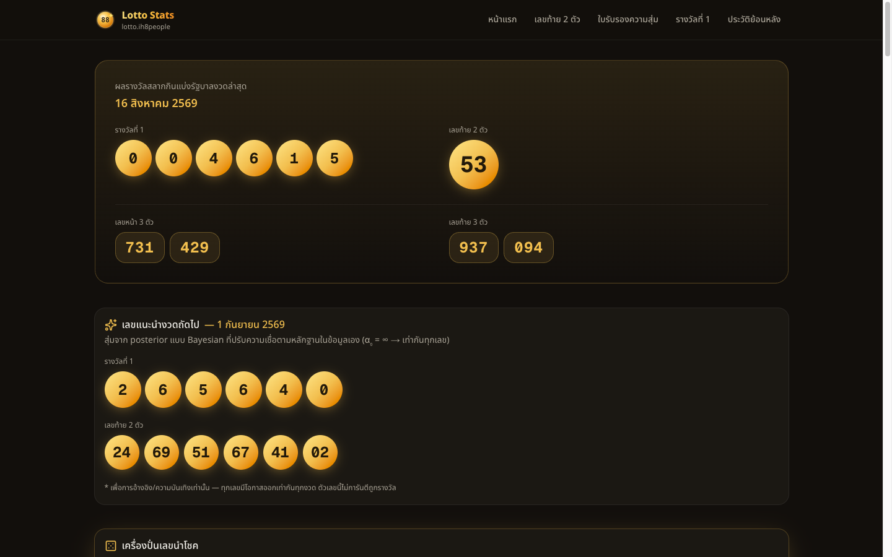
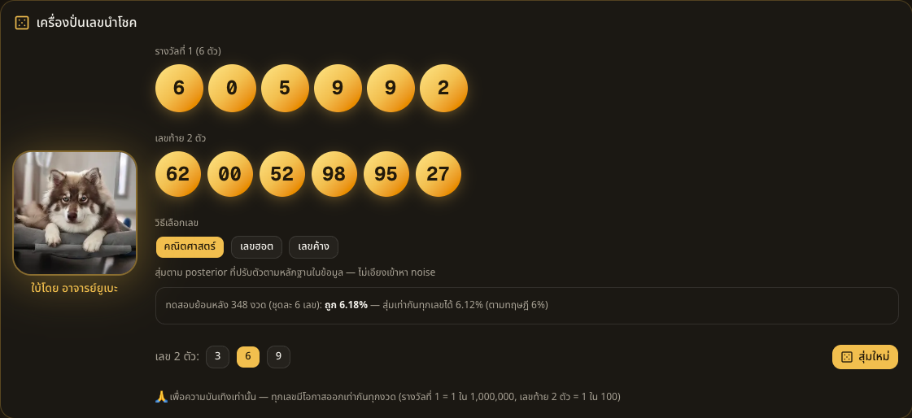
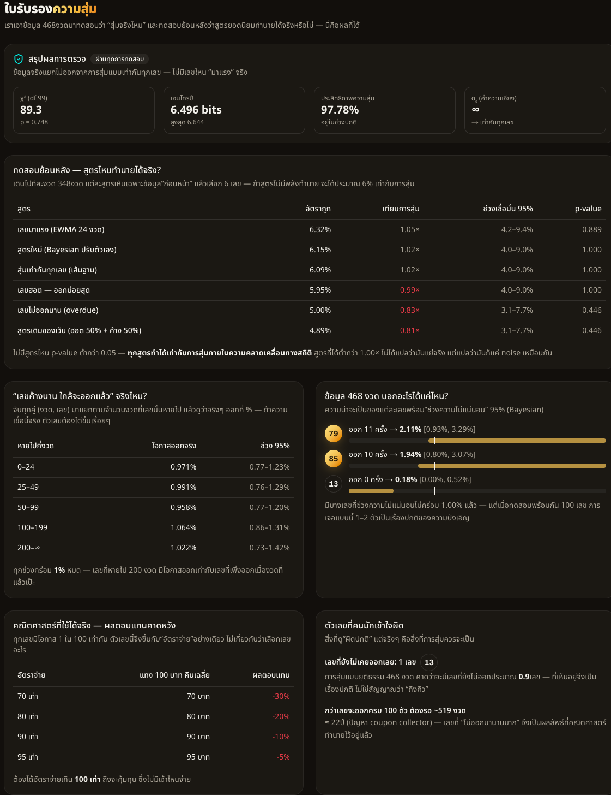
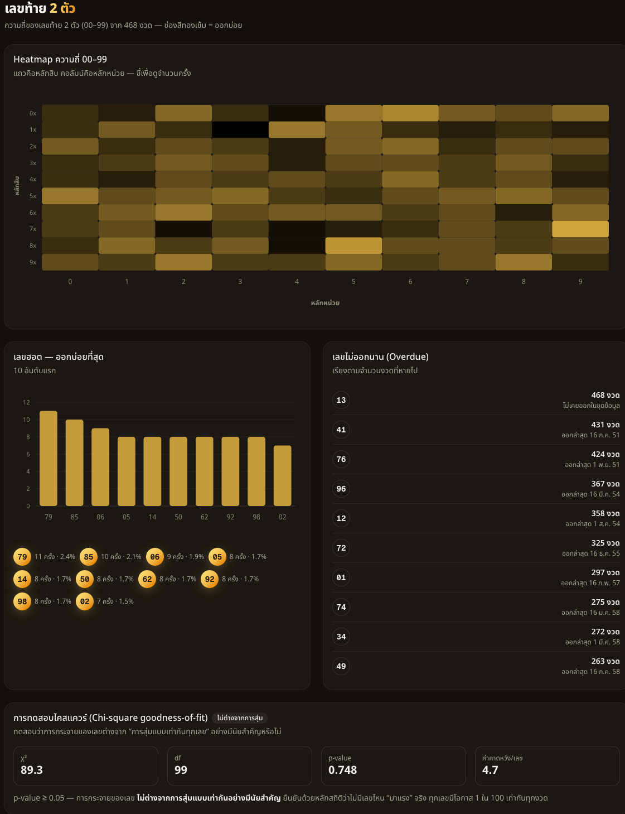
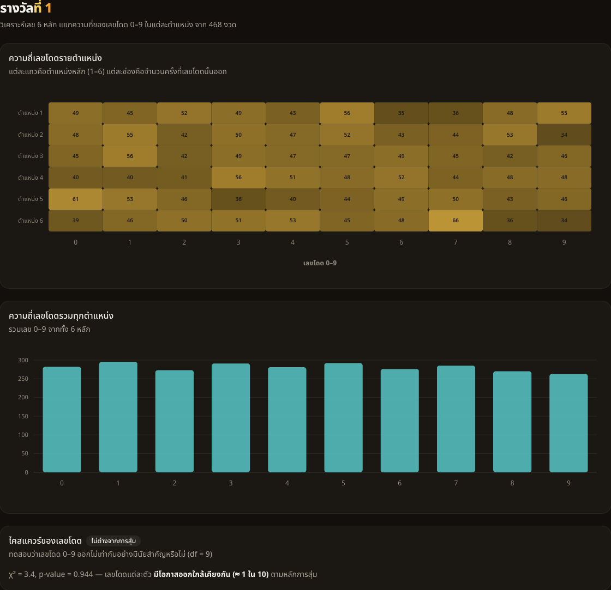

<h1 align="center">🎰 Lotto Stats</h1>

<p align="center">
  <b>วิเคราะห์สถิติหวยไทยด้วยหลักความน่าจะเป็น — แล้วพิสูจน์ด้วยตัวเลขว่าไม่มีสูตรไหนเอาชนะการสุ่มได้</b><br/>
  รางวัลที่ 1, เลขท้าย 2 ตัว, เลขหน้า/ท้าย 3 ตัว ย้อนหลังทุกงวดตั้งแต่ปี 2549 ในฐานข้อมูลของเราเอง
  อัพเดตอัตโนมัติทุกวันที่ 1 และ 16 พร้อม<b>ใบรับรองความสุ่ม</b>ที่เดินการทดสอบย้อนหลังให้ดูว่า
  “เลขฮอต” กับ “เลขค้างนาน” ทำคะแนนได้จริงเท่าไหร่
</p>

<p align="center">
  <a href="https://lotto.ih8people.xyz"></a>
  <a href="./LICENSE"></a>
  
  
  
  <a href="./SECURITY.md"></a>
  <a href="https://github.com/sponsors/captainkie"></a>
  <a href="https://buymeacoffee.com/captainkiez"></a>
</p>

<p align="center">
  
</p>

> ⚠️ **เพื่อการศึกษา/ความบันเทิงเท่านั้น** — การออกรางวัลเป็นเหตุการณ์สุ่มอิสระ
> ผลในอดีตไม่สามารถทำนายผลในอนาคตได้ ทุกเลขมีโอกาสออกเท่ากันทุกงวด
> เว็บนี้ตั้งใจ **พิสูจน์** ข้อความนั้นด้วยตัวเลข ไม่ใช่ขายสูตรเลขเด็ด

---

## Stack

- **Next.js 16** (App Router) + TypeScript
- **shadcn/ui** (Base UI) + Tailwind v4 — ธีม dark + gold/neon
- **ApexCharts** — heatmap 00–99, ความถี่รายหลัก, timeline
- **Supabase (Postgres) + Prisma** — ฐานข้อมูลของเราเอง (single source of truth)
- **Vercel** + Vercel Cron — deploy + อัพเดตอัตโนมัติ
- **Vitest** — unit tests ของ stats core และ ingest

## ข้อมูล

**หลักการ:** DB ของเราเองคือ source of truth เดียว — เวลา user เปิดเว็บ แอปอ่านจาก DB เท่านั้น
ไม่เคยยิงไปหา third-party ตอน request การดึงข้อมูลจากภายนอกเกิดเฉพาะใน write path
(cron / admin / seed)

| แหล่ง | บทบาท | ครอบคลุม |
|-------|-------|----------|
| **GLO** (`src/lib/glo.ts`) | **แหล่งอ้างอิงหลัก** — JSON API ของสำนักงานสลากฯ | 2010-03-01 → ปัจจุบัน |
| **sanook.com** (`src/lib/sanook.ts`) | scrape สำหรับปีที่ GLO ไม่ครอบคลุม | ก่อน 2010 + รางวัลย่อย |
| `data/history.json` | backfill ชุดแรกจาก CSV เปิด `heart/Data-Set-Thai-Lotto` | 2006–2024 |

ปัจจุบันเก็บ **468 งวด** (2006-12-30 → 2026-08-16) โดย 467 งวดมีรางวัลย่อยครบ

**เก็บอะไรบ้างต่อหนึ่งงวด:** `date`, `firstPrize` (6 หลัก), `last2` (2 หลัก) และรางวัลย่อยแบบ
list ความยาวไม่คงที่ — `front3`, `last3`, `second`, `third`
(ขนาดรางวัลเปลี่ยนตั้งแต่งวด **1 ก.ย. 2558** — ก่อนหน้านั้นไม่มีเลขหน้า 3 ตัว และเลขท้าย 3 ตัวมี 4 รางวัล)

รางวัลย่อยมีไว้เพื่อ **statistical power**: หนึ่งงวดให้ `last2` แค่ค่าเดียว (รวม ~470 ค่า กระจายบน 100 ช่อง —
น้อยเกินกว่าจะจับ bias ของเครื่องออกรางวัลได้) แต่รางวัลย่อยเพิ่มอีก 19 เลขต่องวด ทำให้ sample
ระดับหลักเพิ่มขึ้นราว 100 เท่า

**หมายเหตุเรื่องวันที่:** วันออกรางวัลคือ *ข้อมูล* ไม่ใช่ *การคำนวณ* — ปกติวันที่ 1 และ 16
แต่เลื่อนได้รอบวันหยุด (เช่น 2015-05-02, 2015-06-02) และงวดเดือน พ.ค. 2563 ถูกยกเลิกเพราะโควิด
โค้ดที่ *เดา* วันที่จากปฏิทินจะสร้างงวดผีขึ้นมาเสมอ (CSV ต้นทางเคยมีงวดผี 2020-05-16
และตกงวด 2011-03-01 — แก้จาก GLO แล้วด้วย `npm run reconcile:glo`)

---

## อัลกอริทึม

โค้ดทั้งหมดอยู่ใน [`src/lib/stats.ts`](src/lib/stats.ts) — pure function ล้วน ไม่มี side effect
ทุกฟังก์ชันคำนวณจาก input อย่างเดียว และมี unit test กำกับ

### 1. สถิติเชิงบรรยาย

- `last2Frequency` / `digitFrequencyByPosition` — ความถี่ต่อเลข และต่อหลัก
- `chiSquareLast2` / `chiSquareDigits` — ไคสแควร์ goodness-of-fit เทียบ uniform (คำนวณ p-value ในตัว)
- `overdueLast2` — เลขที่ไม่ออกนาน (gap)
- `ewmaLast2` — ความถี่ถ่วงน้ำหนักตามเวลา (half-life 24 งวด)
- `entropyLast2` — เอนโทรปีเทียบกับ null band ที่จำลองจากการสุ่มจริง
- `gapHazardLast2` — อัตราการออกจริง แยกตามช่วง gap (ทดสอบตรง ๆ ว่า "ค้างนาน = ใกล้ออก" จริงไหม)

### 2. การคาลิเบรตเครื่องปั่นเลข (ส่วนที่ปรับใหม่)

ก่อนหน้านี้เครื่องปั่นเลขใช้สูตรกึ่งความเชื่อ — ถ่วงน้ำหนัก *เลขฮอต 50% + เลขค้าง 50%*
ปัญหาคือมันสมมติไปเองว่ามี bias อยู่ ทั้งที่ยังไม่เคยตรวจว่าข้อมูลรองรับหรือเปล่า

ตอนนี้เปลี่ยนเป็น **empirical-Bayes** ด้วย Dirichlet–multinomial แบบสมมาตร (`fitConcentration`):

สำหรับ `X ~ DM(n, α₀)` บน `K` ช่องที่ควรมีโอกาสเท่ากัน จะได้
`E[χ²] = df · (n + α₀) / (1 + α₀)` เมื่อ match moment กับ `ρ̂ = χ² / df` แล้วแก้สมการได้

```
α₀ = (n − ρ̂) / (ρ̂ − 1)
```

จากนั้น `posteriorPredictive` ให้ความน่าจะเป็นของแต่ละเลขเป็น

```
P(v) = (count_v + α₀/K) / (n + α₀)
```

- **`ρ̂ > 1`** — ข้อมูลกระจายตัวมากกว่าที่การสุ่มยุติธรรมอธิบายได้ → `α₀` มีค่าจำกัด
  → posterior เอียงเข้าหาความถี่จริง **เท่าที่หลักฐานรองรับ ไม่เกินกว่านั้น**
- **`ρ̂ ≤ 1`** — ข้อมูลไม่ได้กระจายเกินการสุ่มยุติธรรมเลย → `α₀ → ∞`
  → posterior **ยุบเป็น uniform เป๊ะ ๆ**

**ผลบนข้อมูลจริง:** `χ² = 89.26`, `df = 99`, `p = 0.75`, `ρ̂ ≈ 0.90` → `α₀ = ∞`
เอนโทรปี `6.496 bits` จากเพดาน `6.644` (97.8%) อยู่ในกรอบ null `[6.434, 6.525]` พอดี

แปลว่า **เครื่องปั่นเลขสุ่มแบบ uniform** ซึ่งถูกต้องแล้ว — และนั่นคือจุดประสงค์ทั้งหมดของการคาลิเบรต:
ตัวประมาณค่าตัดสินใจเองจากข้อมูล ไม่ใช่จากความเชื่อของคนเขียน
โหมด `"hot"` / `"overdue"` ยังเหลือไว้ให้ UI **แสดงว่าสูตรพวกนั้นทำคะแนนได้จริงแค่ไหน**

### 3. Backtest — ตัวตัดสิน

`backtestLast2` ทำ walk-forward: ณ งวดที่ `t` กลยุทธ์เห็นเฉพาะงวดที่เก่ากว่า `t` เท่านั้น
เลือกมา 6 เลข แล้ววัดว่าเลขที่ออกจริงอยู่ในนั้นไหม (in-sample frequency จะเข้าข้างกลยุทธ์ที่ overfit เสมอ
walk-forward เป็นวิธีเดียวที่ยุติธรรม)

มี 2 โหมดการเลือก เพราะมันตอบคนละคำถาม:

- **`selection: "sample"`** — สุ่มถ่วงน้ำหนักแบบไม่ซ้ำ = วิธีที่เครื่องปั่นเลขเล่นจริง
- **`selection: "topk"`** — หยิบ N อันดับแรกตรง ๆ = วิธีที่คนเล่นตามลิสต์ "เลขฮอต"/"เลขค้างนาน"

ผลจริง — 6 เลข/งวด, 348 งวดที่ให้คะแนน, baseline ตามโอกาส = **6.00%**:

| กลยุทธ์ | `sample` | lift | `topk` | lift |
|---------|---------:|-----:|-------:|-----:|
| `posterior` (คาลิเบรต) | 6.18% | 1.03 | 6.15% | 1.02 |
| `uniform` (สุ่มล้วน) | 6.12% | 1.02 | 6.09% | 1.02 |
| `ewma` | 6.06% | 1.01 | 6.32% | 1.05 |
| `hot` (เลขฮอต) | 5.89% | 0.98 | 5.95% | 0.99 |
| `overdue` (เลขค้างนาน) | 5.72% | 0.95 | **5.00%** | **0.83** |
| `legacy` (สูตรเดิม ฮอต 50% + ค้าง 50%) | 6.18% | 1.03 | **4.89%** | **0.81** |

**ทุกช่องมี `p ≥ 0.44`** — ไม่มีกลยุทธ์ไหนต่างจากการสุ่มอย่างมีนัยสำคัญ ระยะห่างที่เห็นคือ noise ล้วน ๆ
สังเกตว่าสูตรความเชื่อ (`hot`, `overdue`, `legacy`) เมื่อเล่นแบบที่คนเล่นจริง (`topk`)
ทำได้ **ต่ำกว่า** การสุ่มมั่ว ๆ ด้วยซ้ำ

การ tie-break ของ `topk` **สุ่ม** ซึ่งเป็นเรื่องจำเป็น: posterior ที่คาลิเบรตแล้วแบนสนิท
ถ้า tie-break ตามลำดับ index มันจะเล่น `00`–`05` ทุกงวด

### 4. Determinism

sampler และ backtest ใช้ PRNG `mulberry32` ที่ seed ได้ (seed ปริยายของ sampler = `draws.length`)
ทำให้ "เลขแนะนำ" บนหน้าแรกคงที่ทุก render จนกว่าจะมีข้อมูลใหม่เข้ามา —
**ห้ามใส่ `Math.random()` ลงในโมดูลนี้** `backtestLast2` และ null band ของเอนโทรปีถูก memoize
โดย key จาก hash ของ *เนื้อข้อมูล* (ความยาว + วันที่ล่าสุดไม่ unique พอ)

---

## หน้าตาเว็บ

**เครื่องปั่นเลข บอกคะแนนของตัวเองมาด้วย.** ปุ่มสามโหมดคือสามความเชื่อ และใต้ปุ่มคือผลทดสอบย้อนหลัง
ของโหมดที่เลือกอยู่จริง ๆ — ไม่ใช่คำโฆษณา ตัวเลข `6.18%` เทียบกับเส้นฐาน `6%` คือระยะห่างที่ noise
อธิบายได้ทั้งหมด และเว็บก็เขียนไว้ตรง ๆ อย่างนั้น



**ใบรับรองความสุ่ม — หัวใจของเว็บ.** ไคสแควร์ เอนโทรปี ค่าความเอียง `α₀` และตารางทดสอบย้อนหลัง
ที่จัดอันดับทุกสูตรพร้อม p-value ในหน้าเดียว สังเกตว่าสูตรความเชื่อทั้งสามอยู่ *ท้าย* ตาราง
ต่ำกว่าการสุ่มมั่ว ๆ



**เลขท้าย 2 ตัว.** Heatmap 00–99, เลขฮอต, เลขไม่ออกนาน และผลไคสแควร์ที่ยืนยันว่าการกระจายตัว
ไม่ต่างจากการสุ่มอย่างมีนัยสำคัญ



**รางวัลที่ 1.** ความถี่ของเลขแต่ละหลักแยกตามตำแหน่ง — ทดสอบแยกกันทีละหลัก



---

## เริ่มพัฒนา

```bash
cp .env.example .env      # ใส่ค่า Supabase + secrets
npm install
npm run db:push           # sync schema ขึ้น Supabase
npm run db:secure         # ใส่ RLS + revoke grants + default ของ list column
npm run seed              # backfill + gap-fill งวดล่าสุด
npm run dev
```

## Scripts

| คำสั่ง | หน้าที่ |
|--------|--------|
| `npm run dev` / `build` | dev / production build (`build` ต้องคง `prisma generate` นำหน้าไว้) |
| `npm test` | unit tests (stats + ingest) |
| `npm run lint` | eslint |
| `npm run db:push` | sync Prisma schema → Supabase |
| `npm run db:secure` | ใส่ RLS + revoke `anon`/`authenticated` + default ของ list column |
| `npm run seed` | เติมข้อมูลย้อนหลัง + งวดล่าสุด (idempotent) |
| `npm run backfill:prizes` | เติมรางวัลย่อยให้งวดที่ยังขาด (resumable, rate-limited) |
| `npm run reconcile:glo` | ตรวจวันที่/เลขกับ GLO (dry run; `-- --apply` เพื่อเขียนจริง) |

## Environment variables

ดู [`.env.example`](.env.example) — `DATABASE_URL`, `DIRECT_URL` (Supabase), `ADMIN_PASSWORD`, `CRON_SECRET`
ไฟล์ `.env*` ทั้งหมดถูก gitignore ยกเว้น `.env.example`

## Security

เว็บนี้ **ไม่มีบัญชีผู้ใช้ ไม่มีคุกกี้ ไม่เก็บข้อมูลส่วนบุคคล ไม่มี analytics** — สิ่งเดียวที่ DB เก็บคือ
ผลรางวัลซึ่งเป็นข้อมูลสาธารณะอยู่แล้ว ของที่ต้องปกป้องจริง ๆ คือ **ความถูกต้องของข้อมูล**
และ **credential ของ Supabase**

- **RLS:** Supabase เปิดทุกตารางใน schema `public` ผ่าน PostgREST และให้สิทธิ์ `anon` เต็มโดยปริยาย
  โปรเจกต์นี้ไม่ได้ใช้ supabase-js เลย จึงปิดประตูนั้นทิ้งใน [`prisma/sql/rls.sql`](prisma/sql/rls.sql):
  เปิด RLS บน `Draw` โดย **ไม่มี policy** + `REVOKE ALL` จาก `anon`/`authenticated`
  + `ALTER DEFAULT PRIVILEGES` ให้ตารางใหม่สืบทอด
  (Prisma ต่อเป็น owner จึง bypass RLS — อย่าใส่ `FORCE ROW LEVEL SECURITY`)
- **`/admin`:** รหัสผ่านร่วมตัวเดียว เทียบแบบ **constant-time** (hash ก่อนแล้ว `timingSafeEqual`),
  **ล็อก 15 นาทีหลังเดาผิด 8 ครั้งต่อ IP**, และ **fail closed** เมื่อไม่ได้ตั้ง `ADMIN_PASSWORD`
  — ดู [`src/lib/admin-auth.ts`](src/lib/admin-auth.ts)
- **`/api/cron`:** ต้องมี `Authorization: Bearer $CRON_SECRET` — header `x-vercel-cron`
  เพียงอย่างเดียวถือว่าปลอมได้
- **Security headers ทุก route** ([`next.config.ts`](next.config.ts)): HSTS, `nosniff`,
  `Referrer-Policy`, `frame-ancestors 'none'` + `X-Frame-Options: DENY`, `Permissions-Policy`
  และ `X-Robots-Tag: noindex` เฉพาะ `/admin`
- **ไม่มี raw SQL** — ทุก query ผ่าน Prisma ไม่มี `$queryRaw`/`$executeRaw` ในโค้ดฐาน

ข้อจำกัดที่รู้อยู่ (ตัวนับล็อกเอาต์อยู่ใน memory แยกตาม process, ไม่มี CSP เต็มรูปแบบ,
sanook เชื่อได้ไม่เต็มร้อย) เขียนไว้ครบพร้อมเหตุผลใน **[SECURITY.md](SECURITY.md)**
พร้อมวิธีแจ้งช่องโหว่ — ใช้ private vulnerability reporting ของ GitHub อย่าเปิด public issue

## อัพเดตอัตโนมัติ

`vercel.json` ตั้ง Cron ยิง `GET /api/cron` เวลา 11:00 UTC (18:00 น. ไทย) ทุกวันที่ 1 และ 16

ลำดับการดึงข้อมูล: GLO `getLatestLottery` (รางวัลครบ + วันที่จาก GLO เอง)
→ GLO archive หน้าแรก เพื่อ self-heal งวดที่หลุดไป → sanook ตามวันที่ canonical
เฉพาะกรณี GLO ไม่คืนอะไรเลย ทุก write ผ่าน `upsertDraw` ซึ่ง **ไม่เคยเขียนทับรางวัลที่มีอยู่แล้วด้วยค่าว่าง**

## ผู้พัฒนา

โปรเจกต์ของ **[Fosivo Labs Co., Ltd.](https://fosivo.com)** พัฒนาโดย
**Narenrit Hadsadintorn** ([@captainkie](https://github.com/captainkie)) ร่วมกับ
**[Claude](https://claude.com/claude-code)** (Anthropic) ในฐานะ AI pair-builder

ชื่อที่สองไม่ใช่ของประดับ และถูก *บันทึกไว้* ไม่ใช่แค่พูดถึง — ทุก commit ที่ Claude ลงมือ
มี trailer `Co-Authored-By` ติดอยู่ `git log` จึงบอกได้ว่าใครเขียนอะไรโดยไม่ต้องอาศัยความทรงจำใคร

ส่วนที่เถียงกันหนักที่สุดคือ**การคาลิเบรต** — เดิมเครื่องปั่นเลขใช้สูตร “ฮอต 50% + ค้าง 50%”
ซึ่งสมมติไปเองว่ามี bias อยู่ ทั้งที่ยังไม่เคยตรวจว่าข้อมูลรองรับหรือเปล่า
ข้อสรุปคือให้ **ข้อมูลเป็นคนตัดสินว่าจะเอียงแค่ไหน** และเมื่อคำตอบออกมาว่า “ไม่ควรเอียงเลย”
ก็ต้องยอมให้เครื่องปั่นสุ่มแบบ uniform — พร้อมเก็บสูตรเดิมไว้ในตารางทดสอบย้อนหลัง
เพื่อให้เห็นกับตาว่ามันทำคะแนนได้ต่ำกว่าการสุ่ม

## License

**[MIT](LICENSE)** — เอาไปใช้ แก้ไข ต่อยอด หรือใส่ในของที่ขายก็ได้ ขอแค่ติดประกาศลิขสิทธิ์ไปด้วย
ไม่มีเงื่อนไขเชิงพาณิชย์แยกต่างหาก

สิ่งที่ **ไม่ได้** อยู่ใต้สัญญาอนุญาตนี้: ข้อมูลผลรางวัลเป็นของสำนักงานสลากกินแบ่งรัฐบาล (GLO)
ซึ่งเป็นข้อมูลสาธารณะ, รูปมาสคอต และเครื่องหมายการค้าใด ๆ ที่ปรากฏบนเว็บ

## สนับสนุนงานนี้

เว็บนี้ฟรี ไม่มีโฆษณา ไม่มี tracker และจะเป็นแบบนั้นต่อไป ถ้ามันมีประโยชน์กับคุณ ขอบคุณได้ที่:

- [GitHub Sponsors](https://github.com/sponsors/captainkie)
- [Buy Me a Coffee](https://buymeacoffee.com/captainkiez)

รายงานบั๊กพร้อมวิธีทำซ้ำ มีค่าเท่ากับเงิน และใช้เงินน้อยกว่า

ติดต่อ **Fosivo Labs Co., Ltd.** — <https://fosivo.com>
